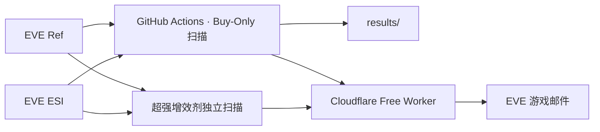

# EVE 公开合同捡漏与超强增效剂蓝图监控

面向《EVE Online》宁静服务器的公开合同发现、估值、排序和游戏邮件提醒工具。程序只做发现与提醒，不会自动接受合同、买入、运输、生产或出售物品。

## 当前策略：Buy-Only

通用的 **现货、BPC 制造、多件合同** 已统一到以“可执行兑现”为核心的模型：

- 合同总价上限：**5,000,000,000 ISK（50亿）**。
- 现货和多件合同的出售价值：**只按 Jita 4-4 当前真实买单深度逐层计算，不参考卖价**。
- 买单吃不掉的剩余数量：按 **0 ISK** 估值。
- 现货/多件默认门槛：**净利润 ≥30M、ROI ≥10%**。
- 舰船 SKIN / SKINR、纳米涂层、设计元素等制作材料如果构成合同主要价值来源，默认剔除；现货/多件按 Jita 买单价值占比 ≥50% 判定。
- BPC 制造粗筛后保留**最优 500 份**进入制造成本精算；旗舰/资本级船体与建筑物本体蓝图在精算前过滤，不占用这 500 个名额。
- 无法解析路线以及陌生、未确认可访问的玩家建筑不作为普通可执行机会。
- 最终机会按绝对可兑现净利润优先排序，而不是按卖价折扣或风险分先截断。

> “只参考 Jita 买价”指**出售/兑现端**。BPC 制造需要买材料，因此材料成本仍使用实际可采购的卖单深度；否则会低估成本。

## 零月费架构

- **GitHub Actions**：重计算、合同扫描、估值、排序和定时运行。
- **Cloudflare Free Worker**：EVE SSO、刷新授权、游戏邮件中转、打开合同/市场窗口、技能读取。
- **EVE Ref**：合同、市场和静态资料快照。
- **EVE ESI**：公开合同/市场/路线/主权数据及游戏邮件投递。



## 当前监控频道

| 频道 | 判断依据 | 收件人 |
|---|---|---|
| 现货捡漏 | 买入合同后按 Jita 买单立即兑现的净利润 | MikeChong、Vektor Yang |
| 多件合同捡漏 | 同一 Buy-Only 模型，至少 2 种物品 | MikeChong、Vektor Yang |
| BPC 制造 | 成品按 Jita 买单兑现，扣蓝图、材料、制造、税和运输 | MikeChong、Vektor Yang |
| BPC 蓝图价差 | 同种 BPC 每流程公开合同挂牌价差；仅作低估信号 | MikeChong、Vektor Yang |
| 超强增效剂制造 | 独立增效剂制造利润监控 | MikeChong |
| 超强增效剂蓝图价差 | 同种超强增效剂 BPC 每流程合同价格断层 | MikeChong |

## 通用工作流

`.github/workflows/scan.yml` 当前主要顺序：

1. `runner_buy_only.py`：BPC 制造扫描；**合同 >50亿、SKIN/SKINR、旗舰/资本级船体、建筑物本体**在制造精算前剔除。廉价经济学粗筛后，按潜在利润排序保留**最优 500 份**进入材料、工业费用、市场深度和工厂成本精算。成品收入只来自 Jita 买单；Broker 和改价预留为 0。
2. `bpc_contract_benchmark_buy_only.py`：BPC 每流程挂牌比较；在建立同类比较池前剔除 >50亿和 SKIN/SKINR 相关蓝图，防止异常合同抬高基准。
3. `apply_buy_only_bpc_policy.py`：对 BPC 输出做第二层价格/SKIN保护，并按 Buy-Only 模型复核制造净利润。
4. `buy_only_contract_scanner.py`：一次扫描同时生成现货和多件结果；**完全不使用 Jita 卖价估值**。
5. `prepare_mail_candidates.py`：邮件门槛。
6. `add_action_links.py`：补充游戏内操作链接。
7. `send_eve_mail_buy_only_multi.py`：现货 + BPC 邮件。
8. `send_multi_item_buy_only_multi.py`：多件合同邮件。
9. 将 `results/` 安全提交回 `main`。

旧的 `contract_deal_scanner.py` 和 `multi_item_contract_scanner.py` 仍保留用于历史对照及复用位置/路线函数，但**已不再是当前现货和多件机会的核心估值入口**。

## 现货 / 多件利润公式

```text
Jita买单毛值 = 按当前买单价格和剩余数量逐层成交
即时可兑现值 = Jita买单毛值 - 销售税 - 运输预留
净利润 = 即时可兑现值 - 合同价
ROI = 净利润 / (合同价 + 运输预留)
```

不会用 Jita 卖单、历史均价或估价去给缺少买盘的剩余物品补价值。

### 买盘压力测试

邮件同时显示一个保守指标：对每种物品移除当前最佳一档 Jita 买单，再重新计算一次利润。它用于识别“利润几乎完全依赖一个异常买单”的机会，但不是完整价格冲击模型。

## BPC 制造

BPC 制造的成品收入端使用当前 Jita 买单深度。当前流程是：先对全量可制造 BPC 做便宜的经济粗筛，然后按潜在利润排序，保留**前 500 份**进入昂贵的精确制造计算。

在这 500 份形成之前会先过滤：

- 航母、无畏、力辅、工业旗舰、枪骑无畏、超级航母、泰坦；
- 货舰、跳货等资本级大型船体；
- Citadel、Engineering Complex、Refinery、FLEX、Control Tower、Assembly Array、主权建筑等建筑物本体；
- SKIN/SKINR 及皮肤制作相关蓝图；
- 合同价 >50亿的 BPC。

结构模块本身不会因为名称里出现 `Structure` 就被笼统排除；过滤目标是建筑物/结构本体。

制造成本口径：

```text
制造净利润
= 成品Jita买单收入
- BPC合同价
- 材料实际采购成本
- 工业安装费
- 销售税
- 配置运输费
```

因为假设成品直接出售给已有买单，所以不再扣自己挂卖单才会产生的 Broker 和改价预留。

默认制造邮件主要要求：净利润 ≥20M、ROI ≥10%、当前盈利买盘至少能容纳一份合同产量。

## BPC 蓝图挂牌价差

蓝图挂牌价差与制造利润是两个独立信号：

```text
每流程价格 = 合同总价 / 总流程
同类比较 = 同种蓝图，优先同 ME/TE
挂牌价差 = 同类挂牌参考价值 - 当前合同价
```

**挂牌价差不是可兑现利润。** 它只说明该 BPC 相对其他公开合同报价偏低。邮件会明确写“蓝图挂牌价差（不是可兑现利润）”。

比较池本身也会先排除 >50亿合同和 SKIN/SKINR 相关蓝图，避免 troll 高价合同虚高平均值。

## SKIN / SKINR 过滤

现货与多件合同会结合物品名称、物品组和 Jita 买单贡献识别：

- 舰船 SKIN；
- SKINR；
- Nanocoating / 纳米涂层；
- Sequencing Binder；
- Design Element；
- Pattern Projection 等皮肤制作类元素。

相关物品的 Jita 买单价值占整包 ≥50% 时，整个合同不进入机会榜。BPC 则直接排除相关蓝图/产品候选。

## 邮件

新版标题会直接区分新策略：

```text
现货捡漏·Jita买单
BPC捡漏·买单制造/蓝图价差
多件合同捡漏·Jita买单
```

现货/多件正文主要显示：合同价、Jita 买单毛值、销售税、运输、买单覆盖、净利润、ROI、压力利润、SKIN 占比、位置和合同链接。

BPC 正文把“制造后 Jita 买单即时兑现利润”和“蓝图挂牌价差”明确分开。

策略迁移使用新的榜单状态版本，因此第一次 Buy-Only 正式运行会重新推送新版摘要，即使部分合同编号与旧版相同。

## 累计推送次数

每类机会均记录累计次数：

- 现货：`spot-deals`
- 通用 BPC：`bpc-value`
- 多件合同：`multi-item-buy-only`
- 超强增效剂制造：`booster-manufacturing`
- 超强增效剂价差：`booster-spread`

邮件内显示“本合同累计推送：第 N 次”或对应累计次数。多收件人共享一次扫描周期的机会次数，不会因同时发给两个人而加两次。

## 自动运行

| 工作流 | 调度 | 说明 |
|---|---|---|
| `EVE arbitrage scans` | 每小时 07/17/27/37/47/57 分提供触发机会，25 分钟门控后通常约每 30 分钟完整扫描一次 | 40 分钟上限 |
| `药品制造蓝图监控` | 每小时 03/13/23/33/43/53 分 | 独立增效剂扫描 |
| `Deploy Cloudflare EVE Worker` | 手动或 Worker 源码变更 | 只部署中转 Worker |

代码 push 只保留最新一轮验证任务；定时扫描使用独立并发组，不会被下一次定时触发自动取消。GitHub cron 仍可能延迟。

## 主要输出

| 文件 | 用途 |
|---|---|
| `results/latest/contract_deals.csv` | Buy-Only 现货榜 |
| `results/latest/contract_deals_all.csv` | 全部合格现货记录 |
| `results/latest/multi_item_contract_deals.csv` | Buy-Only 多件榜 |
| `results/latest/multi_item_contract_all.csv` | 全部合格多件记录 |
| `results/latest/ranked_opportunities.csv` | BPC 制造榜 |
| `results/latest/bpc_value_opportunities.csv` | BPC 挂牌价差榜 |
| `results/state/mail_push_history.csv` | 通用机会累计推送次数 |
| `results/state/mail_last_top10_<收件人>.csv` | 现货/BPC 收件人榜单状态 |
| `results/state/mail_last_multi_buyonly_top10_<收件人>.csv` | Buy-Only 多件榜单状态 |
| `results/state/last_scan_started_epoch.txt` | 通用定时门控 |
| `eve-booster-monitor-state` 分支 `state.json` | 增效剂扫描与投递状态 |

## 超强增效剂

超强增效剂仍由独立工作流处理，详细规则见 [`booster-monitor/README.md`](booster-monitor/README.md)。制造利润和同种 BPC 每流程价差为两个独立频道，并分别累计推送次数。

## 重要边界

- Jita 买单是数据快照，不保证运输到达后仍存在。
- 压力利润只是删除最佳一档买单的快速压力测试。
- 公开玩家建筑资料不能证明 Dock 权限，因此陌生建筑采取保守排除。
- BPC 挂牌价差不是成交价，也不应当作制造利润。
- ESI、EVE Ref 和 GitHub 定时任务都可能有缓存或调度延迟。

Cloudflare 配置见 [`cloudflare/SETUP.md`](cloudflare/SETUP.md)。
