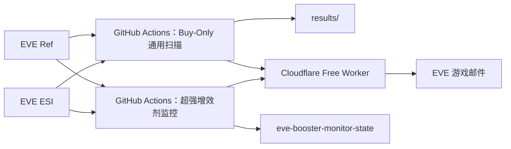

# EVE 公开合同捡漏与超强增效剂蓝图监控

面向《EVE Online》宁静服务器的公开合同发现、估值、排序和游戏邮件提醒工具。

程序只做**发现与提醒**：不会自动接受合同，不会自动购买、运输、生产或出售物品。最终操作前仍应在游戏客户端核对合同、地点、物品、流程数和最新市场深度。

## 当前核心原则：Buy-Only

通用的三类推送——**现货捡漏、BPC 捡漏、多件合同捡漏**——已经统一到新的执行逻辑：

1. **合同总价必须 ≤ 5,000,000,000 ISK（50亿）**。
2. **舰船 SKIN / SKINR 以及其制作类设计元素为主要价值来源的合同不进入现货和多件榜单**；默认按 Jita 买单价值计算，相关物品占整包价值 ≥50% 时剔除。
3. **现货和多件合同的价值只按 Jita 4-4 当前真实买单深度逐层计算，不再参考卖价。**
4. 买单吃不掉的剩余数量在即时兑现模型中直接按 **0 ISK** 估值。
5. 利润扣除销售税和配置运输预留；地点必须能解析并存在路线。陌生、未确认可访问的玩家建筑默认不当作可执行机会。
6. 普通现货/多件合同统一要求默认 **净利润 ≥30M、ROI ≥10%**，再按绝对净利润排序。
7. 每个现货、BPC、多件、增效剂机会都保留/新增累计推送次数提示。

> “只看 Jita 买价”指**出售/兑现端的估值**只使用 Jita 买单。BPC 制造所需材料仍按实际采购成本计算，材料采购自然需要使用可买到的卖单深度；否则会低估制造成本。

## 架构

项目按零月费运行：

- **GitHub Actions**：合同下载、ESI/EVE Ref 查询、估值、排序、定时扫描。
- **Cloudflare Free Worker**：EVE SSO、刷新授权、发送游戏邮件、打开合同/市场窗口、技能读取。
- **EVE Ref**：公开合同、市场和静态资料快照。
- **EVE ESI**：公开合同/物品、市场历史、路线、主权以及游戏邮件投递。



## 监控频道

| 频道 | 当前核心判断 | 收件人 |
|---|---|---|
| 现货捡漏 | 合同买入后按 Jita 当前买单深度立即兑现 | MikeChong、Vektor Yang |
| 多件合同捡漏 | 同一 Buy-Only 模型，仅保留至少 2 种物品的整包合同 | MikeChong、Vektor Yang |
| BPC 制造 | 成品按 Jita 当前买单深度兑现，扣蓝图、材料、制造、税和运输 | MikeChong、Vektor Yang |
| BPC 蓝图价差 | 同种 BPC 按每流程公开合同挂牌价比较；只是低估信号，不当作可兑现利润 | MikeChong、Vektor Yang |
| 超强增效剂制造 | 独立增效剂制造监控 | MikeChong |
| 超强增效剂蓝图价差 | 同种超强增效剂 BPC 每流程合同价断层 | MikeChong |

## 通用扫描执行顺序

当前 `.github/workflows/scan.yml` 的主要顺序：

1. `runner.py`：BPC 制造扫描。工作流把 Broker/改价预留设为 0，因为成品直接打现有 Jita 买单。
2. `bpc_contract_benchmark_buy_only.py`：BPC 每流程挂牌比较；在建立比较池之前先排除 >50亿合同和 SKIN/SKINR 相关 BPC。
3. `apply_buy_only_bpc_policy.py`：再次对 BPC 输出执行价格上限、SKIN 过滤，并按 Jita 买单收入重新核算制造净利润。
4. `buy_only_contract_scanner.py`：一次扫描同时生成现货和多件合同结果；完全不使用 Jita 卖价估值。
5. `prepare_mail_candidates.py`：邮件门槛。
6. `add_action_links.py`：补充 EVE 操作链接。
7. `send_eve_mail_buy_only_multi.py`：现货 + BPC 邮件。
8. `send_multi_item_buy_only_multi.py`：多件合同邮件。
9. 保存 `results/` 回 `main`。

旧的 `contract_deal_scanner.py` 和 `multi_item_contract_scanner.py` 仍留在仓库中用于历史对照/复用部分位置函数，但**当前工作流已经不再用它们作为现货和多件机会的核心估值入口**。

## 现货 / 多件 Buy-Only 模型

`buy_only_contract_scanner.py` 对公开 `item_exchange` 合同执行：

```text
Jita买单毛值 = 按当前买单价格和剩余数量逐层成交
即时可兑现值 = Jita买单毛值 - 销售税 - 运输预留
净利润 = 即时可兑现值 - 合同价
ROI = 净利润 / (合同价 + 运输预留)
```

没有足够买单接住的数量不使用“卖单价”“历史均价”或“估价”补齐，而是直接按 0。

### 额外执行性过滤

- 合同价格：1M～5B ISK（上限默认 50亿）。
- 排除要求买方额外提供物品的合同。
- BPC 交给 BPC 专用扫描，不混入现货。
- SKIN/SKINR 类价值占比 ≥50%：剔除。
- 无法解析星系/路线：剔除。
- 陌生且未确认友军权限的玩家建筑：剔除。

### 压力测试

邮件额外显示一个保守指标：

> 对每种物品删除当前最佳一档 Jita 买单后，再重新计算一次利润。

该值用于观察机会是否过度依赖一张异常高价买单；当前主要入选门槛仍使用真实当前买单深度。

## BPC 制造

BPC 制造收入端本来就是逐层吃 Jita 买单。新版进一步明确：

- 成品收入：**Jita 买单深度**。
- 材料成本：Jita 实际可采购深度。
- 扣除：BPC 合同价、材料、工业安装费、销售税、配置运输。
- 不再扣“挂卖 Broker”和“改价预留”，因为策略假设是成品直接卖给已有买单，而不是自己挂卖单。
- 合同 >50亿：最终结果剔除。
- SKIN/SKINR 相关蓝图/产品：最终结果剔除。

制造邮件默认主要门槛仍为：

- 净利润 ≥20M；
- ROI ≥10%；
- 当前买盘容量至少容纳一份合同产量。

## BPC 蓝图挂牌价差

这条路径与制造利润独立。

```text
每流程价格 = 合同总价 / 总流程
同类比较 = 同种蓝图，优先同 ME/TE
挂牌价差 = 同类挂牌参考价值 - 当前合同价
```

注意：**挂牌价差不是“利润”**。它只用于发现同种 BPC 中明显偏低的报价，不代表有人会按其他合同的高挂牌价购买。

新版在形成同类比较池之前就先去掉：

- 合同价 >50亿；
- SKIN/SKINR/纳米涂层/设计元素等相关蓝图。

因此极端高价合同不会再用于抬高同类均价。

## 邮件变化

新版邮件标题会直接带出新策略，例如：

```text
现货捡漏·Jita买单
BPC捡漏·买单制造/蓝图价差
多件合同捡漏·Jita买单
```

现货/多件正文重点显示：

- 合同价；
- Jita 买单毛值；
- 销售税；
- 运输预留；
- 买单数量覆盖；
- 即时净利润；
- ROI；
- 删除最佳一档买单后的压力利润；
- SKIN/SKINR 价值占比；
- 位置与跳数；
- 本合同累计推送次数。

BPC 邮件把两个概念明确分开：

- **制造后 Jita 买单即时兑现利润**；
- **蓝图挂牌价差（不是利润）**。

策略切换到 Buy-Only 后使用新的榜单状态版本，因此首次运行会重新发一轮新版摘要，即使部分合同编号与旧版 TOP 恰好相同。

## 推送次数

- 现货：`spot-deals` 历史累计。
- 通用 BPC：`bpc-value` 历史累计。
- 多件合同：新版使用 `multi-item-buy-only` 累计。
- 超强增效剂：`booster-manufacturing` 和 `booster-spread` 分开累计。

多收件人只把一次扫描周期计为一次机会推送，不因为发送给两个人就把次数加两次。

## 自动运行

| 工作流 | 调度 | 说明 |
|---|---|---|
| `EVE arbitrage scans` | 每小时 07/17/27/37/47/57 分提供触发机会，25 分钟门控后通常约每 30 分钟完整跑一次 | 40 分钟上限 |
| `药品制造蓝图监控` | 每小时 03/13/23/33/43/53 分 | 独立增效剂扫描 |
| `Deploy Cloudflare EVE Worker` | 手动或 Worker 源码变更 | 只部署中转 Worker |

GitHub cron 可能延迟，不能把这些分钟理解成严格实时保证。

## 超强增效剂

超强增效剂仍是独立工作流，详细逻辑见 [`booster-monitor/README.md`](booster-monitor/README.md)。其当前双通道为：

- 制造利润机会；
- 同种 BPC 每流程挂牌价差机会。

二者独立入选并各自累计推送次数。

## 主要输出

| 文件 | 用途 |
|---|---|
| `results/latest/contract_deals.csv` | Buy-Only 现货榜 |
| `results/latest/contract_deals_all.csv` | Buy-Only 现货全部合格记录 |
| `results/latest/multi_item_contract_deals.csv` | Buy-Only 多件合同榜 |
| `results/latest/multi_item_contract_all.csv` | Buy-Only 多件全部合格记录 |
| `results/latest/ranked_opportunities.csv` | BPC 制造榜 |
| `results/latest/bpc_value_opportunities.csv` | BPC 挂牌价差榜 |
| `results/state/mail_push_history.csv` | 通用机会累计推送次数 |
| `results/state/mail_last_top10_<收件人>.csv` | 现货/BPC 每收件人 TOP 状态 |
| `results/state/mail_last_multi_buyonly_top10_<收件人>.csv` | Buy-Only 多件每收件人 TOP 状态 |
| `results/state/last_scan_started_epoch.txt` | 定时扫描门控 |
| `eve-booster-monitor-state` 分支 `state.json` | 增效剂扫描、机会和投递状态 |

## 重要边界

- Jita 买单是快照，不保证你真正运到 Jita 时仍存在。
- “压力利润”只是删除最佳一档买单的快速压力测试，不是完整的价格冲击模型。
- 公开玩家建筑数据不能证明你拥有 Dock 权限，因此新版对陌生玩家建筑采取保守排除。
- BPC 挂牌价差不是成交价，也不应与制造净利润混为一谈。
- ESI/EVE Ref 数据和 GitHub 定时任务都可能存在缓存或调度延迟。

Cloudflare 配置见 [`cloudflare/SETUP.md`](cloudflare/SETUP.md)。
