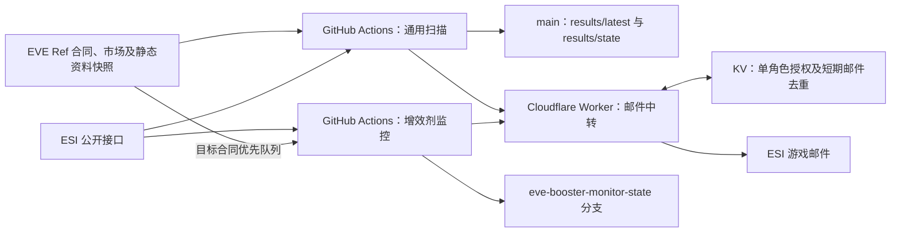

# EVE 公开合同捡漏与增效剂蓝图监控

面向《EVE Online》宁静服务器的公开合同发现、估值与游戏邮件提醒工具。程序不会创建、接受或自动购买合同，也不会自动运输、生产或出售物品。

本说明依据当前工作流和源码整理。报价、机会数量、授权是否有效及邮件是否投递，应查看对应运行记录，不能从 README 推断实时状态。

## 当前功能与架构

| 监控类别 | 判断依据与实际入口 | 当前云端收件人 |
|---|---|---|
| 通用蓝图拷贝 | `runner.py` 做制造估值；`bpc_contract_benchmark.py` 做同类蓝图每流程挂牌比较；两条路径均可入选 | MikeChong、Vektor Yang |
| 现货合同 | `contract_deal_scanner.py` 按吉他买单、卖单深度估值，可处理单件或多件 | MikeChong、Vektor Yang |
| 多件物品包 | `multi_item_contract_scanner.py` 检查至少两种物品的估值覆盖、流动性折扣和整包价值差 | MikeChong、Vektor Yang |
| 超强增效剂制造蓝图 | `booster-monitor/cloud_run.py` 按气体自制材料成本和成品成交参考价估值；本机入口为 `app.py` | 仅 MikeChong |

前三类在同一个通用工作流中依次执行，各自生成榜单。增效剂监控有独立程序、工作流及状态分支。现货与多件物品包的范围存在重叠，没有跨所有频道的统一合同去重。

Cloudflare Worker 提供官方登录回调、授权刷新、邮件中转、合同/市场窗口打开和技能读取。**扫描及估值由 Python 执行，Worker 不负责扫描，也没有扫描定时器。**

Worker 的 KV 只保存一份角色授权，所有调用共用该角色。部署使用 LadyGuaGua 发信时，重新授权成其他角色也会改变邮件、技能和窗口功能使用的身份。增效剂中转客户端额外核对 LadyGuaGua 的姓名和编号；通用发信脚本使用 Worker 当前授权角色，不能描述为两者具有完全相同的角色保护。

详细说明：[增效剂监控](booster-monitor/README.md) · [Cloudflare 服务配置](cloudflare/SETUP.md)

## 自动运行与执行顺序

| 工作流 | 触发与频率 | 限制 |
|---|---|---|
| [EVE arbitrage scans](.github/workflows/scan.yml) | 每小时第 7、17、27、37、47、57 分钟提供定时触发机会；定时运行还要求距上次记录的扫描开始时间至少 25 分钟，通常约每 30 分钟一次。手动及匹配路径推送不受这项间隔限制 | 40 分钟；同组运行不互相取消 |
| [药品制造蓝图监控](.github/workflows/booster-monitor.yml) | 每小时第 3、13、23、33、43、53 分钟；也支持手动和匹配路径推送 | 90 分钟；通常一轮最多核验 800 个待查合同，手动可选 1 或 10 轮 |
| [Deploy Cloudflare EVE Worker](.github/workflows/deploy-cloudflare-worker.yml) | 手动，或 Worker 源码/部署工作流变更 | 部署 Worker，不执行合同扫描 |

GitHub 调度与 ESI 缓存可能延迟，这些是配置频率，不是准点或实时承诺。增效剂手动运行的 `dry_run` 只停止邮件，仍会扫描并保存公开状态；默认关闭，即允许发信。

通用工作流依次执行：

1. `runner.py`：快速制造估值。
2. `bpc_contract_benchmark.py`：蓝图挂牌比较，并回填制造榜字段。
3. `contract_deal_scanner.py`、`filter_reachable_contract_deals.py`：现货估值与可达性过滤。
4. `multi_item_contract_scanner.py`：独立多件物品包估值。
5. `prepare_mail_candidates.py`、`add_action_links.py`：邮件门槛筛选及部分结果文件的操作链接。
6. `send_eve_mail_quality_multi.py`、`send_multi_item_mail_multi.py`：根据榜单变化发送邮件。
7. 保存 `results/` 回 `main`。

这些步骤不是彼此独立的任务；前面失败可能阻止后续扫描、发信或结果保存。

## 通用蓝图：挂牌比较与制造利润

### 挂牌比较

仅对纯蓝图拷贝、单一蓝图类型的出售合同建立同类比较；同类型多张拷贝按总流程合并。排除合同自身后，优先比较相同蓝图类型、材料效率和时间效率的样本；样本不足时退回同类型不同效率的合同。样本足够时处理极端离群报价。

| 条件 | 扫描榜默认门槛 | 邮件默认门槛 |
|---|---:|---:|
| 可比合同数 | 至少 3 | 至少 5 |
| 低于可比均价 | 至少 25% | 至少 30% |
| 低于可比中位价（中位数有效时） | 至少 10% | 至少 20% |
| 按均价估算的价值差 | 至少 1000 万 ISK | 至少 2000 万 ISK |

这是**公开挂牌价差，不是历史真实成交价格**，也不保证蓝图能按可比价格卖出。扫描价值榜最多输出 200 份。

### 制造估值

工作流运行 `runner.py`，不是直接运行 `scanner_source.py`。入口在内存中应用快速筛选、费用模型与数值保护后执行源码；直接运行原始源码不会获得全部相同设置。

模型使用吉他材料卖单和成品买单深度，并比较吉他周边高安 NPC 工厂的安装费。扣除蓝图、材料、工业安装费、销售税、经纪费、改价预留和配置运输费。系统成本指数、设施税与 SCC 附加费是安装费拆分，不重复扣除。

快速模式只继续处理单一成品批次，默认经济预筛最多 150 份、比较 2 个工厂，并要求有近期成交量。制造邮件路径要求利润至少 2000 万 ISK、回报率至少 10%、市场容量至少容纳一份合同。

制造路径当前排除玩家建筑交货合同，以及源码分类为旗舰或超级旗舰的制造候选；不能把挂牌价值路径的地点和产品范围直接套到制造路径。运输参数 `HIGHSEC_HAUL_ISK_PER_M3` 默认是 0，模型也会对按买单估算的收入扣经纪费与改价预留。这些是代码中的费用假设，不是已取得完整运输报价或实际成交费用凭证。

### 最终邮件排名

挂牌价值和制造利润可以各自独立入选。邮件排序取以下两者的较大值，再以回报率辅助排序：

- 符合条件的制造利润。
- 挂牌估值差乘以样本可信度系数：5–9 个样本为 65%，10–19 个为 80%，20 个及以上为 90%。代码保留更低样本档，但默认邮件门槛不接收少于 5 个样本的价值信号。

**当前不是“蓝图自身折价永远排在制造利润之前”**。扫描 CSV 的评分排序与最终邮件排序也不完全相同。

## 现货与多件物品包

现货 A 类按吉他可成交买单量估算，B 类按卖单参考价值扣费用估算；B 类不是立即可兑现利润。扫描门槛分别为 A 类 1500 万/10%、B 类 2500 万/15%，邮件层再统一要求利润至少 3000 万、回报率至少 10%。

现货默认只为预筛前 500 份做地点等后续处理，主榜最多输出 150 份，邮件从主榜继续筛选。最终邮件按净利润排序，但上游主榜优先考虑风险等级，不能称为全市场不受风险影响的绝对前十。

现货邮件入口按名称过滤服装、装饰品和涂装关键词。这是邮件层文字匹配，不是严格物品分类；不影响通用蓝图和独立多件物品包频道。

多件物品包另要求至少两种物品，排除要求买家提供物品的合同和包含蓝图拷贝的合同。默认合同价至少 100 万、估值覆盖率至少 90%、相对净估值折价至少 30%、净价值差至少 3000 万 ISK，并要求地点可解析、普通星门路线可达。主榜最多输出 250 份。

多件 A 类只给买单能覆盖的部分计价，剩余物品在该路径按零计入；B 类按主要物品近期成交历史调整流动性折扣，再扣费用和运输预留。工作流中的 `MULTI_MIN_A_BUY_COVERAGE` 目前没有被扫描源码读取，不能将其写成已生效的 90% 买单覆盖门槛。估值覆盖率与买单覆盖率是不同指标。

## 地点与风险范围

通用挂牌价值、现货和多件物品包路径可包含高安、低安及 00，要求位置可解析和路线可达；玩家建筑可通过 EVE Ref 建筑资料定位。制造及增效剂路径有各自限制，不能统一描述为使用同一套地点过滤。

| 风险标签 | 代码含义 |
|---|---|
| A1 | 配置角色所属联盟的主权星系，或显式配置的友军联盟/星域 |
| A2 | 吉他安全路线不超过配置跳数的高安，默认 25 跳 |
| B | 其他高安 |
| C | 低安 |
| D | 非友军 00 等高风险或位置未知情况 |

当前工作流用角色编号 `2124493042` 查询公开联盟信息，再结合主权地图；不是固定绑定某个联盟，也不读取完整外交蓝名单。友军、可达或高安标签不等于已验证建筑停靠权限和实际运输安全。

**已知实现边界：**`bpc_contract_benchmark.py` 的 `enrich_locations()` 当前用“跳数 or -1”判断，会把合法的 0 跳转换为 -1，误排除吉他本地合同的挂牌价值候选。本次文档同步不改变这段代码，不能据此判断吉他没有低价蓝图。

增效剂监控遍历 ESI 星域目录和公开合同分页，允许远地交货，但尚未接入上述 A1–D 分层、路线验证或实际运输报价；邮件主要显示星域和地点编号。

## 邮件什么时候发送

通用三个频道各最多选取 10 份，从默认前 80 份候选中调用 ESI 合同物品第一页检查可见性。失败或不可见的候选会剔除；不是无限查到凑齐十份，也不是重新核验整包物品和全部市场价格。ESI 缓存仍可能滞后。

- 现货与通用蓝图按收件人、频道保存有序合同编号列表。成员或顺序变化才重新发送；相同列表仅利润数字变化不会触发。累计推送次数在收件人之间共享。
- 多件物品包使用一份共享有序列表去重，再广播给收件人；新增收件人没有前两类那样的独立首次推送状态。
- 上述频道首次为空或由有机会变为空时也可能发“暂无强机会”；列表不变则跳过。因此不是每轮固定发送两封或三封邮件。
- 增效剂同一收件人的合同成功投递后不再重复提醒，结果不确定时等待核对；每封最多 10 份，并设置约 30 分钟发信间隔，不采用榜单变化重发规则。

通用邮件的持久化在发信之后；Worker 的短期去重也不是跨所有任务的永久保证。增效剂额外使用发信前检查点和独立台账，不能把两套实现统称为“绝不会重复发信”。

## 输出与状态

| 路径 | 用途 |
|---|---|
| `results/latest/bpc_value_opportunities.csv`、`bpc_value_all.csv` | 蓝图挂牌价值主榜与比较记录 |
| `results/latest/ranked_opportunities.csv`、`all_executable_scored.csv` | 制造排名和估值 |
| `results/latest/product_watchlist.csv`、`excluded.csv`、`meta.json` | 产品观察、排除原因和制造扫描元数据 |
| `results/latest/contract_deals.csv`、`contract_deals_all.csv` | 现货主榜与记录 |
| `results/latest/multi_item_contract_deals.csv`、`multi_item_contract_all.csv` | 多件物品包主榜与记录 |
| `results/state/opportunity_history.csv` | 制造机会历史 |
| `results/state/last_scan_started_epoch.txt` | 通用定时扫描间隔判断 |
| `results/state/mail_push_history.csv`、`mail_last_top10_<收件人>.csv` | 通用邮件累计次数及收件人榜单去重 |
| `results/state/mail_last_multi_top10.csv` | 多件物品包共享去重 |
| `eve-booster-monitor-state` 分支的 `state.json` | 增效剂核验进度、机会及投递记录 |
| `booster-monitor/data/` | 本机 SQLite 数据和独立授权文件；不要上传 |
| Cloudflare KV `AUTH_STORE` | Worker 单角色授权与 48 小时邮件请求去重 |

旧格式 `mail_last_top10.csv` 可能仍存在，当前多收件人入口使用带收件人后缀的文件。公开仓库的结果和状态分支同样公开。CSV 名称中的 `all` 表示该脚本输出的处理记录，不代表全部公开合同均已完整估值。

## 配置与维护

通用扫描以 [.github/workflows/scan.yml](.github/workflows/scan.yml) 的环境变量为准；未覆盖项再使用入口或源码默认值。

| 配置组 | 主要参数 |
|---|---|
| 蓝图挂牌扫描 | `BPC_VALUE_MIN_SAMPLES`、`BPC_VALUE_MIN_EXACT_SAMPLES`、`BPC_VALUE_MIN_DISCOUNT`、`BPC_VALUE_MIN_MEDIAN_DISCOUNT`、`BPC_VALUE_MIN_SURPLUS`、`BPC_VALUE_TOP` |
| 蓝图邮件门槛 | `MAIL_BPC_VALUE_MIN_*`、`MAIL_BPC_MFG_MIN_PROFIT`、`MAIL_BPC_MFG_MIN_ROI` |
| 制造快速模式 | `MIN_NET_PROFIT`、`MIN_NET_ROI`、`PREFILTER_TOP`、`PREFILTER_MIN_GROSS_REVENUE`、`PREFILTER_MIN_ROI`、`PREFILTER_MAX_OUTPUT_DAYS_30D`、`HIGHSEC_FACTORY_CANDIDATES` |
| 市场及运输费用 | `ACCOUNTING_LEVEL`、`MARKET_BROKER_FEE_RATE`、`ADV_BROKER_RELATIONS_LEVEL`、`EXPECTED_RELISTS`、`HIGHSEC_HAUL_ISK_PER_M3`、`DEAL_HAUL_*` |
| 现货、友军、多件包 | `DEAL_MIN_*`、`MAIL_SPOT_MIN_*`、`DEAL_FRIENDLY_CHARACTER_ID`、`DEAL_FRIENDLY_ALLIANCE_IDS`、`DEAL_FRIENDLY_REGION_IDS`、`MULTI_MIN_*`、`MULTI_TOP` |
| 通用邮件 | `EVE_MAIL_API_KEY`、`EVE_MAIL_WORKER_URL`、`EVE_MAIL_RECIPIENT_NAMES`、`MAIL_TOP`、`MAIL_LIVE_POOL` |
| 增效剂 | [cloud-config.json](booster-monitor/cloud-config.json) 覆盖 [core.py](booster-monitor/core.py) 默认项；本机界面不修改云端配置 |

本机通用扫描需要在仓库根目录安装 `requirements.txt` 依赖，并按上文顺序运行。发信脚本会产生真实游戏邮件，不属于只读检查。`.data/` 和 `.cache/` 会重复使用，已有同名快照不会在每次本机运行时自动重新下载，不能只凭文件名中的 `latest` 判断新鲜度。

`send_eve_mail_fast.py`、`send_eve_mail_dual.py` 等既保留旧入口，也提供当前脚本导入的函数；是否实际执行以工作流为准。`payload/` 和 `export-scanner.yml` 是源码导出机制，运行导出会从压缩载荷覆盖 `scanner_source.py`，不是常规扫描的前置步骤。

增效剂网页需要 Python 后端，不是单独发布 `index.html` 就能使用的静态页面。[Worker 配置文档](cloudflare/SETUP.md) 说明共享授权、技能与窗口操作的边界。
