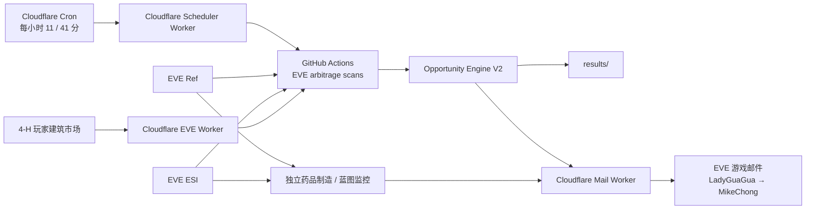

# EVE 捡漏监控 / Opportunity Engine V2

面向《EVE Online》宁静服务器的自动化捡漏发现、实时复核、排序和游戏内邮件提醒系统。

当前生产版已经从“静态价差扫描”升级为 **Opportunity Engine V2**：候选机会先广泛发现，再使用实时订单深度、滑点、压力测试、流动性、运输约束和执行可行性做二次复核，只把达到 `SAFE` 的机会自动推送。

> 本项目只负责发现、分析和提醒，不会自动接受合同、买入、运输、生产或出售物品。

## 当前生产架构



### 调度职责

生产扫描的定时职责已经从 GitHub Cron 迁移到 Cloudflare：

- Cloudflare Cron：`11,41 * * * *`
- 即每小时第 **11 分、41 分**触发，约每 30 分钟一轮。
- Cloudflare Worker 调用 GitHub `workflow_dispatch`。
- `.github/workflows/scan.yml` 中不再使用 GitHub 自带 schedule 作为生产定时器。
- 对 `scan.yml` 相关代码的普通 `push` 只做加载/验证，不发送生产邮件。

这样可以避免 GitHub Cron 延迟造成的漏跑、乱序和重复触发。

## 当前自动提醒频道

正式捡漏邮件统一由 **LadyGuaGua** 发送给 **MikeChong**。

| 频道 | 当前逻辑 | 自动邮件 |
|---|---|---|
| 现货合同捡漏 V2 | 合同买入后按 Jita 4-4 当前真实买单深度即时兑现 | 是，SAFE only |
| BPC 制造捡漏 V2 | BPC + 材料 + 制造费 → 成品 → Jita 当前买单兑现 | 是，SAFE only |
| 多件合同捡漏 V2 | 多物品合同按实时 Jita 买单深度逐项兑现 | 是，SAFE only |
| 4-H 合同捡漏 V2 | 4-H 合同按 4-H 本地买盘 / Jita 买盘执行复核 | 是，SAFE only |
| 4-H 市场套利 V2 | 4-H 实际卖单买入 → Jita 实际买单卖出 | 是，SAFE only |
| BPC 蓝图挂牌低估 | 同类 BPC 公开合同挂牌价比较 | 仅研究输出，当前不自动邮件 |
| 超强增效剂制造 | 独立药品制造利润监控 | 独立工作流 |
| 超强增效剂蓝图价差 | 同种增效剂 BPC 每流程价格断层 | 独立工作流 |

BPC 的“蓝图挂牌低估”和“制造套利”是两个不同信号：

- **BPC-VALUE**：说明挂牌价格相对同类合同偏低，不代表一定能立刻卖出。
- **BPC-MFG**：使用真实材料采购成本和成品买单深度计算，属于可执行制造套利。

当前自动邮件只推送后者的 `SAFE` 机会。

## Opportunity Engine V2

V2 的核心流程：

```text
Candidate Scan
    ↓
Live Revalidate
    ↓
Execution Feasibility
    ↓
Liquidity / Slippage / Stress
    ↓
SAFE / CHANGED / DANGER
    ↓
Score / Grade
    ↓
Mail Gate
```

### SAFE / CHANGED / DANGER

- `SAFE`：实时订单、深度、利润、ROI、运输和压力测试均满足要求，可以进入自动提醒。
- `CHANGED`：候选仍可能有价值，但实时情况已经和发现阶段明显不同，默认不自动推荐。
- `DANGER`：订单深度、利润、运输、限制条件或数据完整性存在明显问题，不自动推送。

### 买单深度与 VWAP

系统不是简单读取“最佳买价”，而是按订单深度逐层成交：

```text
成交价值 = Σ(每一档价格 × 该档实际可成交数量)
VWAP = 成交总价值 / 成交数量
```

如果整份合同产量无法被真实买单深度完整吃掉，则机会会被降级或剔除，而不会用估价补足缺口。

### 压力测试

V2 会移除当前最佳一档订单，再重新计算利润。

这样可以识别：

- 纸面利润几乎完全依赖一个异常买单；
- 最佳档被别人先成交后利润立刻消失；
- 大批量成交造成明显价格冲击。

## 现货 / 多件合同模型

当前现货与多件合同完全采用 Buy-Only 执行模型：

```text
Jita买单毛值 = 按当前 Jita 4-4 买单深度逐层成交
即时可兑现值 = Jita买单毛值 - 销售税 - 运输预留
净利润 = 即时可兑现值 - 合同价
ROI = 净利润 / (合同价 + 运输预留)
```

主要生产门槛：

- 合同总价：1M ～ 5B ISK；
- 净利润：通常 ≥30M；
- ROI：通常 ≥10%；
- 必须通过 V2 实时复核后达到 `SAFE`；
- 不用 Jita 卖价、历史均价或第三方估价给缺少买盘的物品补价值。

系统还会过滤：

- SKIN / SKINR 及大量皮肤制作元素；
- 不可解析路线；
- 未确认可访问的陌生玩家建筑；
- 高安无法正常执行的受限旗舰运输机会；
- 已装配/特殊状态导致估值不可靠的部分舰船合同。

## BPC 制造 V2

制造利润模型：

```text
制造净利润
= 成品实时 Jita 买单收入
- BPC 合同价
- 材料实时 Jita 卖单采购成本
- 工业安装费 / SCI / SCC 等
- 销售税
- 运输成本
```

> “Buy-Only”只指成品的兑现端使用真实买单。材料是采购成本，因此材料侧必须使用真实卖单深度。

BPC 制造还会检查：

- ME / TE；
- BPC 流程数；
- 材料逐层卖单采购成本；
- 成品逐层买单变现价值；
- 材料和成品滑点；
- 最佳档移除压力利润；
- 30 天市场成交量；
- 预计消化天数；
- 生产时间和资金占用；
- 高安旗舰 / 建筑物本体 / SKIN 等排除规则。

当前 BPC 自动邮件主要要求：

- V2 `SAFE`；
- 净利润 ≥20M；
- ROI ≥10%。

## 4-H 监控

4-H 使用经过 EVE SSO 授权的玩家建筑市场接口。

### 4-H 合同

`four_h_contract_scanner.py` 先发现 4-H 内的合同候选，再由 V2 检查：

- 4-H 本地买单兑现；
- Jita 买单兑现；
- 实际订单深度；
- 运输体积；
- 高安运输限制；
- 压力利润；
- SAFE / CHANGED / DANGER。

只有最终 `SAFE` 的合同进入邮件。

### 4-H 市场 → Jita

`structure_market_arbitrage.py` / `four_h_market_scanner_v2.py` 计算：

```text
4-H真实卖单买入
    ↓
运输到 Jita
    ↓
Jita真实买单即时卖出
    ↓
扣销售税、运输、滑点和压力测试
```

旗舰等无法按普通高安运输逻辑执行的机会会被 V2 阻断。

## 邮件提醒规则

扫描仍然约每 30 分钟执行一次，但**不代表每 30 分钟一定发邮件**。

为避免重复轰炸，单纯 TOP 排名变化已经不再触发提醒。以下情况会重新发送：

- 新的 SAFE 机会进入榜单；
- 原有 SAFE 机会消失；
- 净利润变化 ≥20M；
- 或净利润相对变化 ≥10%；
- ROI 变化 ≥2 个百分点；
- SAFE / 等级发生变化；
- 同一 SAFE 机会持续约 6 小时仍然有效。

单纯：

```text
TOP6 → TOP5 → TOP6
```

如果只是排序波动而没有实质变化，不再反复发邮件。

## 邮件 Worker 与 EVE SSO

Cloudflare Worker 当前将“主要 EVE 功能授权”和“邮件发件角色”分开管理。

邮件发送固定使用：

```text
LadyGuaGua → MikeChong
```

邮件 Worker 已加入：

- Access Token 内存缓存；
- Cloudflare Cache API 缓存；
- 同一时间只执行一次 Token refresh；
- Refresh Token 轮换保护；
- KV 写入失败容错；
- EVE 已成功接收邮件后，不因去重状态写入失败而错误重试；
- `idempotency_key` 防止重复邮件；
- `/api/mail-health` 非发送型健康检查。

## 故障隔离

4-H 依赖玩家建筑授权和 Cloudflare Worker，因此与核心通用扫描做了隔离：

```text
4-H 故障
   ↓
4-H 本轮标记 degraded
   ↓
不会阻止 BPC / 现货 / 多件合同继续计算和保存
```

同时，生产 Workflow 最后有统一 Health Gate：

- 扫描结果可以先安全保存；
- 邮件失败不会丢掉扫描结果；
- 但邮件实际发送失败时，整个 Workflow 最终会显示失败，而不是“假绿色 success”；
- 4-H 数据源故障也会明确标记生产健康异常。

## Cloudflare Worker 部署与健康检查

### `Deploy Cloudflare EVE Worker`

当以下内容变更时自动部署：

- `cloudflare/worker.js`
- `cloudflare/worker_mail_sender.js`
- `cloudflare/wrangler.jsonc`
- 部署 Workflow 本身

部署步骤包括：

1. Wrangler dry-run；
2. 正式部署；
3. `/health` 检查；
4. `/api/mail-health` 检查；
5. 确认邮件发件角色仍为 `LadyGuaGua`。

### `Cloudflare worker smoke test`

Smoke test 会实际检查：

- Worker health；
- 邮件授权健康；
- 4-H 建筑市场接口；
- 返回数据格式和分页信息。

不会为了健康检查发送测试邮件。

## Reliability CI

`.github/workflows/reliability-ci.yml` 用于防止维护过程中“修一个地方、弄坏另一个地方”。

当前自动验证：

- Python 全项目编译；
- Opportunity Engine V2 单元测试；
- BPC Opportunity Engine V2 单元测试；
- 邮件提醒去重策略测试；
- Cloudflare Worker JavaScript 语法检查；
- Wrangler dry-run。

生产 Python 依赖已固定到经过验证的版本，避免依赖自动升级导致突然故障。

## 生产工作流顺序

`.github/workflows/scan.yml` 当前生产顺序：

1. `runner_buy_only.py` — BPC 制造候选发现；
2. `bpc_contract_benchmark_buy_only.py` — BPC 挂牌低估研究信号；
3. `apply_buy_only_bpc_policy.py` — BPC 第二层策略保护；
4. `buy_only_contract_scanner_v2.py` — 现货 + 多件合同 V2；
5. `four_h_contract_scanner.py` — 4-H 合同 V2；
6. `structure_market_arbitrage.py` — 4-H 市场 → Jita V2；
7. `prepare_mail_candidates.py` — SAFE 邮件门槛；
8. `add_action_links.py` — EVE 客户端快捷链接；
9. 现货 + BPC 邮件；
10. 多件合同邮件；
11. 4-H 合同 + 市场邮件；
12. 安全提交 `results/`；
13. Final production health gate。

## 主要输出

| 文件 | 用途 |
|---|---|
| `results/latest/contract_deals.csv` | 现货合同结果 |
| `results/latest/multi_item_contract_deals.csv` | 多件合同结果 |
| `results/latest/ranked_opportunities.csv` | BPC 制造基础结果 |
| `results/latest/ranked_opportunities_v2.csv` | BPC 制造 V2 实时复核结果 |
| `results/latest/bpc_v2_safe_candidates.csv` | BPC SAFE 邮件候选 |
| `results/latest/bpc_value_opportunities.csv` | BPC 挂牌低估研究结果 |
| `results/latest/bpc_value_opportunities_v2.csv` | BPC 低估 V2 置信度结果 |
| `results/latest/four_h_contract_bargains.csv` | 4-H 合同 V2 结果 |
| `results/latest/four_h_to_jita_buy.csv` | 4-H 市场 → Jita 结果 |
| `results/state/mail_push_history.csv` | 邮件推送历史 |
| `results/state/mail_last_*` | 各频道 / 收件人的提醒去重状态 |
| `results/state/last_scan_started_epoch.txt` | 最近生产扫描开始时间 |

## 自动运行

| 工作流 | 当前调度 | 作用 |
|---|---|---|
| `EVE arbitrage scans` | Cloudflare `11,41 * * * *` → `workflow_dispatch` | 5 大捡漏频道生产扫描 |
| `药品制造蓝图监控` | GitHub Cron `3,13,23,33,43,53 * * * *` | 独立增效剂制造 / BPC 监控 |
| `Deploy Cloudflare EVE Worker` | Worker 源码变更或手动 | 部署并健康检查 Cloudflare Worker |
| `Cloudflare worker smoke test` | Worker / 测试配置变更或手动 | 检查线上 Worker、邮件和 4-H 接口 |
| `Reliability CI` | 关键代码变更 / PR / 手动 | 单测、语法、构建和回归保护 |

## 超强增效剂监控

超强增效剂仍然由独立工作流处理，详细规则见：

[`booster-monitor/README.md`](booster-monitor/README.md)

制造利润和同种 BPC 每流程价差是两个独立频道。

## 当前可靠性原则

维护时遵循以下顺序：

```text
先保证生产可用
→ 再修故障根因
→ 再增加健康检查
→ 再增加自动化测试
→ 最后做性能优化和代码清理
```

当前重点是避免以下历史问题再次出现：

- GitHub Cron 延迟 / 漏跑；
- Cloudflare KV 写入过量导致 Worker 1101；
- Worker 实际发信失败但 GitHub 仍显示 success；
- 4-H 单点故障拖死所有提醒；
- 单纯 TOP 排名波动导致每半小时重复发信；
- 修改邮件 Worker 后代码已更新但线上没有自动部署；
- Python 依赖自动升级导致未来突然不兼容。

## 重要边界

- EVE 市场数据是快照，不能保证你到达市场时价格仍存在。
- 压力测试只是模拟最佳档消失，并不是完整市场冲击模型。
- 玩家建筑接口可访问不代表运输路线一定安全。
- BPC 公开合同挂牌价不是实际成交价。
- `SAFE` 是执行条件过滤结果，不是收益保证。
- 本项目不会自动执行游戏内交易。

## 回滚与历史

V2 升级期间保留了旧版本回滚分支：

```text
legacy-v1-pre-opportunity-engine-v2
```

重大策略修改应优先通过测试 / 分支验证，再进入 `main`，避免直接破坏生产提醒。
