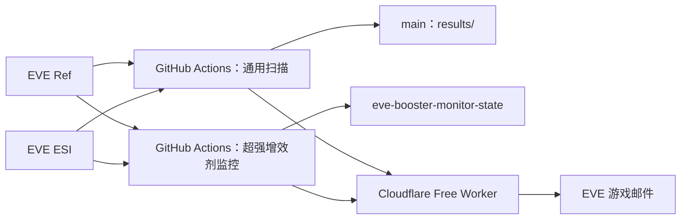

# EVE 公开合同捡漏与超强增效剂蓝图监控

面向《EVE Online》宁静服务器的公开合同发现、估值和游戏邮件提醒工具。

程序只做**发现、估值、排序和提醒**：不会自动接受合同，不会自动买入、运输、生产或出售物品。任何邮件中的“利润”“价差”“折价”都属于程序筛选结果，最终操作前仍应在游戏客户端核对合同、地点、物品、流程数和市场深度。

## 当前架构

项目坚持零月费运行：

- **GitHub Actions**：承担合同下载、ESI 查询、估值和排序等重计算。
- **Cloudflare Free Worker**：只承担 EVE SSO、刷新授权、发送游戏邮件、打开合同/市场窗口和技能读取，不承担重扫描。
- **EVE Ref**：提供公开合同、市场和静态资料快照，也为超强增效剂监控提供目标合同优先提示。
- **EVE ESI**：提供公开合同、合同物品、市场、路线、主权等实时/缓存接口，以及游戏邮件投递。



## 监控频道

| 频道 | 核心判断 | 云端收件人 |
|---|---|---|
| 通用 BPC 制造 | 买蓝图后按材料、工业费用和成品市场计算制造利润 | MikeChong、Vektor Yang |
| 通用 BPC 挂牌价值 | 同类 BPC 按流程折算，与可比合同挂牌价比较 | MikeChong、Vektor Yang |
| 现货合同 | Jita 买单即时兑现或卖单/挂单路径估值 | MikeChong、Vektor Yang |
| 多件物品包 | 整包估值覆盖、流动性折扣、可达性和价值差 | MikeChong、Vektor Yang |
| 超强增效剂制造机会 | 八种超强型增效剂 BPC 的制造利润 | MikeChong |
| 超强增效剂蓝图价差 | 同种超强增效剂 BPC 的每流程价格断层 | MikeChong |

超强增效剂独立说明见 [booster-monitor/README.md](booster-monitor/README.md)。Cloudflare 授权与邮件服务见 [cloudflare/SETUP.md](cloudflare/SETUP.md)。

## 自动运行

| 工作流 | 当前调度 | 说明 |
|---|---|---|
| [EVE arbitrage scans](.github/workflows/scan.yml) | 每小时第 7、17、27、37、47、57 分提供触发机会；定时任务另有“距上次扫描开始至少 25 分钟”的门控，因此通常约每 30 分钟完整扫描一次 | 40 分钟上限 |
| [药品制造蓝图监控](.github/workflows/booster-monitor.yml) | 每小时第 3、13、23、33、43、53 分；也支持手动和匹配路径 push | 90 分钟上限；通常每轮最多核验 800 个待查合同 |
| [Deploy Cloudflare EVE Worker](.github/workflows/deploy-cloudflare-worker.yml) | 手动或 Worker 相关源码变更 | 只部署 Worker，不做扫描 |

GitHub 的 cron 不是严格实时调度，可能延迟。配置频率不能理解为保证在该分钟准点运行。

## 通用扫描执行顺序

一次完整通用扫描主要按下面顺序执行：

1. `runner.py`：BPC 制造估值。
2. `bpc_contract_benchmark.py`：BPC 每流程挂牌价值比较。
3. `contract_deal_scanner.py`：全服现货合同估值。
4. `filter_reachable_contract_deals.py`：移除无法解析/无法找到普通路线的地点。
5. `multi_item_contract_scanner.py`：多件物品包独立估值。
6. `prepare_mail_candidates.py`：统一邮件门槛。
7. `add_action_links.py`：写入可操作链接。
8. `send_eve_mail_quality_multi.py`：发送现货与通用 BPC 邮件。
9. `send_multi_item_mail_multi.py`：发送多件物品包邮件。
10. 将刷新后的 `results/` 安全提交回 `main`。

扫描与邮件不是同一件事。合同扫描已经成功，但邮件接口临时失败时，不应把扫描算法本身误判为失败。

## 通用 BPC：挂牌价值与制造利润

### 挂牌价值路径

`bpc_contract_benchmark.py` 对纯 BPC、单一蓝图类型的出售合同按总流程折算价格，并排除合同自身后寻找同类可比样本。

当前邮件层主要门槛：

| 条件 | 默认值 |
|---|---:|
| 可比合同数 | 至少 5 |
| 低于可比均价 | 至少 30% |
| 中位价有效时低于中位价 | 至少 20% |
| 按比较价估算价值差 | 至少 2000 万 ISK |

这条路径反映的是**公开挂牌价差**，不是历史真实成交价。高价挂单本身不代表有人愿意成交，因此邮件中的蓝图“自身价值”只能用于发现异常低报价。

### 制造路径

制造模型使用材料采购、成品市场深度、工业安装费、销售税、经纪费、改价预留和配置运输费用估算利润。邮件路径当前主要要求：

- 制造净利润至少 2000 万 ISK；
- ROI 至少 10%；
- 市场容量至少能容纳一份合同对应产量。

挂牌价值和制造利润是两条**独立入选路径**。制造利润不达标不会自动否决一个明显低估的 BPC；反之亦然。

## 现货合同

现货扫描分成两类：

- **A 类即时套利**：按当前 Jita 买单深度逐层成交计算，适合判断买回后立即兑现。
- **B 类挂单潜在套利**：按卖单/正常市场价值估算，利润不是即时可兑现利润。

邮件层统一要求净利润至少 3000 万 ISK、ROI 至少 10%。上游扫描仍有自己的预筛门槛，因此邮件门槛不能理解为“全服所有 ≥10% 的 B 类一定都会被扫描到”。

现货邮件会按名称过滤明显服装、装饰品和 SKIN 关键词；这是邮件层过滤，不影响通用 BPC 和多件物品包扫描。

## 多件物品包

多件物品包要求至少两种物品，排除要求买家提供物品的合同和含 BPC 的合同。

当前主要门槛：

- 估值覆盖率至少 90%；
- 相对净估值折价至少 30%；
- 净价值差至少 3000 万 ISK；
- 地点可以解析，并存在普通星门路线。

A 类只给真实买单深度能够接住的数量计价，未覆盖部分在即时路径按 0 计；B 类会参考主要物品近期成交历史做流动性折扣。

### 多收件人邮件容错

多件包现在给每个收件人保存独立 TOP10 状态：

```text
results/state/mail_last_multi_top10_<收件人>.csv
```

明确的上游 HTTP 5xx 邮件错误最多重试 3 次。MikeChong 作为主收件人，如果最终仍发送失败，工作流保持失败；其他收件人的临时邮件故障只记录 warning，不再让已完成的扫描结果和后续结果提交整体作废。

连接中断等“是否已经发送无法确认”的异常不会自动重试，避免重复投递。

## 地点和风险

通用现货/多件路径使用公开联盟、主权、星系安全等级和路线数据标记风险。常见标签：

| 标签 | 含义 |
|---|---|
| A1 | 当前配置角色所属联盟主权范围，或显式配置友军范围 |
| A2 | Jita 安全路线一定跳数以内的高安 |
| B | 其他高安 |
| C | 低安 |
| D | 非友军 00、位置未知等高风险情况 |

“可达”“友军”“高安”都不等于已经验证玩家建筑 Dock 权限，也不代表运输绝对安全。

## 超强增效剂双通道

独立监控八种超强型增效剂制造 BPC：蓝色药丸、撞击感、疯癫、坠落感、思维冲击、梦呓、X—本能、游离感。

### 制造利润通道

按气体/材料采购、成品七日成交参考价、销售费用和额外费用预留估算。默认主要门槛：

- 每张至少 50 剩余流程；
- 每 50 流程利润至少 1 亿 ISK；
- ROI 至少 20%；
- 本批产量不超过七日成交量的一定比例。

### 蓝图每流程价差通道

这个通道**不要求制造利润先达标**，直接从已核验目标 BPC 合同池计算：

```text
每流程价格 = 合同总价 / 总流程数
每流程价差 = 下一份最便宜同种合同每流程价 - 当前每流程价
理论总价差 = 每流程价差 × 当前合同流程数
折价率 = 每流程价差 / 下一档每流程价
```

默认要求：至少 2 份其他同种可比合同、当前报价比下一档至少便宜 20%、理论总价差至少 3000 万 ISK。

“理论总价差”只是公开挂牌合同之间的断层，不是保证利润，也不能证明存在真实买家。

## 推送次数与重复提醒

### 现货与通用 BPC

每个合同显示累计推送次数。TOP10 成员或顺序变化时可以再次发送；相同有序列表通常抑制重复邮件。多收件人之间共享机会累计次数，但各自维护榜单是否已看过的状态。

### 多件物品包

每个收件人维护自己的 TOP10 状态，避免“第一个人收到了，第二个人临时失败后永远错过同一榜单”。

### 超强增效剂

维护两个独立频道：

- `booster-manufacturing`
- `booster-spread`

同一合同可在两个频道同时出现，两边的“已推送第 N 次”分别累计。成功发送后的约 30 分钟只是频道级节流，不是合同永久冷却；合同仍有效并继续满足条件时可以再次提醒。

若一次投递处于 `sending` 或 `unknown`，程序会保守停止自动重发该机会，避免响应丢失导致重复邮件。

## 状态和主要输出

| 路径 | 用途 |
|---|---|
| `results/latest/bpc_value_opportunities.csv` | 通用 BPC 挂牌价值机会 |
| `results/latest/ranked_opportunities.csv` | 通用 BPC 制造机会 |
| `results/latest/contract_deals.csv` | 现货合同机会 |
| `results/latest/multi_item_contract_deals.csv` | 多件物品包机会 |
| `results/state/mail_push_history.csv` | 通用现货/BPC累计推送次数 |
| `results/state/mail_last_top10_<收件人>.csv` | 现货/BPC收件人榜单状态 |
| `results/state/mail_last_multi_top10_<收件人>.csv` | 多件包收件人榜单状态 |
| `results/state/last_scan_started_epoch.txt` | 通用定时扫描间隔门控 |
| `eve-booster-monitor-state` 分支 `state.json` | 增效剂核验状态、`push_state`、累计次数和投递状态 |
| Cloudflare KV `AUTH_STORE` | Worker 单角色授权与短期邮件幂等标记 |

公开仓库中的结果和独立状态分支也是公开内容，不应写入 API Key、EVE Client Secret 或刷新令牌。

## 运行可靠性与日志判断

排查 GitHub Actions 时应区分三类信息：

1. **真正错误**：某一步 conclusion 为 `failure`，并伴随 Python traceback、ESI/API 错误或邮件 HTTP 5xx。
2. **局部外部服务故障**：例如某个收件人的 EVE 邮件接口临时 520/502；这不代表前面的合同扫描失败。
3. **warning**：Pandas/NumPy FutureWarning、DeprecationWarning，以及 GitHub Actions Node.js 运行时弃用提示，目前不等于扫描失败，但应在后续依赖升级前逐步清理。

超强增效剂云端版对 ESI JSON 读取增加了容错：若某路径出现空内容或非 JSON，会清除该路径缓存并重试一次；仍失败时日志应直接显示具体 ESI 路径和当前扫描阶段，而不是只留下 `Expecting value`。

增效剂状态分支采用 fail-closed：`state.json` 为空、损坏或格式不匹配时停止本轮，不自动重置累计次数或投递记录。

## 已知边界

- 合同市场没有像现货市场那样完整的真实买盘深度，BPC 挂牌价差不能当作确定可兑现利润。
- 玩家建筑 Dock 权限没有完整自动验证。
- 超强增效剂制造估值尚未把每张 BPC 的 ME/TE、所有建筑加成、逐份真实安装/燃料/运输报价完整纳入。
- ESI 和 EVE Ref 均存在缓存和更新间隔；“程序刚扫描过”不等于合同此刻仍存在。
- 多个机会分别通过销量门槛，不代表把所有机会同时执行仍能按相同参考价退出。
- 部分 Pandas/NumPy API 当前已有弃用 warning，短期不影响运行，但依赖升级后需要维护。

## 主要源码

### 通用扫描

- `runner.py` / `scanner_source.py`：BPC 制造估值
- `bpc_contract_benchmark.py`：BPC 挂牌价值比较
- `contract_deal_scanner.py`：现货合同
- `multi_item_contract_scanner.py`：多件物品包
- `prepare_mail_candidates.py`：邮件资格门槛
- `send_eve_mail_quality_multi.py`：现货/BPC 多收件人邮件
- `send_multi_item_mail_multi.py`：多件包多收件人邮件和独立收件人状态

### 超强增效剂

- `booster-monitor/app.py`：基础扫描与 Windows 本机界面
- `booster-monitor/monitor_v2.py`：云端双通道、累计次数、价差和 ESI JSON 容错
- `booster-monitor/core.py`：配方、缓存、ESI 和制造估值
- `booster-monitor/cloud_run.py`：Actions 入口和状态分支持久化
- `booster-monitor/relay.py`：Cloudflare 邮件中转

### Cloudflare

- `cloudflare/worker.js`：EVE SSO、邮件、窗口和技能接口
- `cloudflare/SETUP.md`：部署、Secret、KV 和授权说明

## 安全说明

不要把以下内容写入公共仓库、README、结果 CSV 或 Actions 日志：

- EVE Client Secret
- `EVE_MAIL_API_KEY`
- OAuth refresh token
- Cloudflare API Token

本项目不会自动执行市场交易；任何实际 ISK 风险仍由最终人工操作决定。
